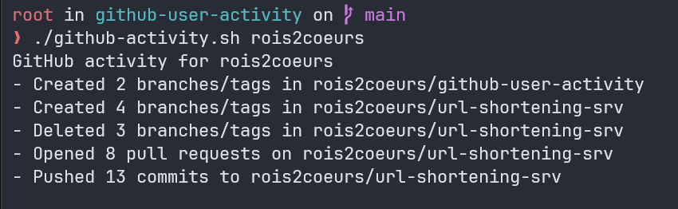

# Github User Activity

A simple script to get the latest activity of a user on Github.

## Requirements

This project require `jq` to be installed on your system. You can install it using the following command:

```bash
sudo apt-get install jq
```

## Preview



## Usage

To use the `github-activity.sh` script, follow the steps below:

1. Ensure that the script is executable by running the following command:

```bash
chmod +x github-activity.sh
```

2. Run the script with the following command:

```bash
./github-activity.sh <username>
```

## Credits

[a roadmap.sh project](https://roadmap.sh/projects/github-user-activity)